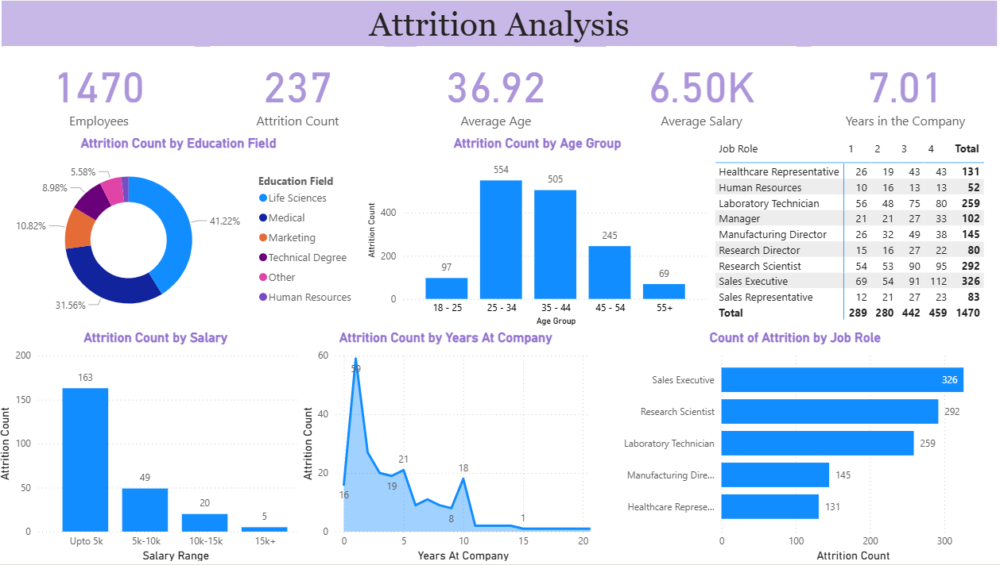

# HR Attrition Analysis Dashboard

A Power BI dashboard for analyzing employee attrition across a workforce of 1,470 employees.
Covers attrition drivers by department, age, salary, education, job role, and tenure,
with DAX-powered KPI cards and interactive cross-filtering throughout.

---

## Dashboard Preview



---

## Key Metrics

| Metric | Value |
|---|---|
| Total Employees | 1,470 |
| Attrition Count | 237 |
| Average Age | 36.92 |
| Average Salary | 6.50K |
| Avg. Years at Company | 7.01 |

---

## Dashboard Components

**KPI Cards**
Total employees, attrition count, attrition rate (%), active employees, and average age --
all calculated using DAX measures with conditional color formatting.

**Attrition by Education Field (Donut Chart)**
Life Sciences accounts for the largest share at 41.22%, followed by Medical at 31.56%.

**Attrition by Age Group (Bar Chart)**
Peak attrition occurs in the 25-34 age group (554 employees), followed by 35-44 (505).

**Attrition by Salary Range (Bar Chart)**
163 of 237 departures come from the lowest salary band (up to 5K), highlighting
a strong relationship between compensation and attrition.

**Attrition by Years at Company (Area Chart)**
Attrition spikes sharply in the first year (59 employees) then stabilizes,
indicating an onboarding and early retention problem.

**Attrition by Job Role (Bar Chart)**
Sales Executives (326) and Research Scientists (292) show the highest attrition counts.

**Work Life Balance by Job Role (Matrix/Heatmap)**
Conditional formatting highlights which roles have the highest concentration
of low work-life balance ratings (1-2 out of 4).

---

## DAX Measures

```dax
Attrition % =
DIVIDE(
    COUNTROWS(FILTER(Table1, Table1[Attrition] = "Yes")),
    COUNTROWS(Table1)
) * 100

Active Employees =
COUNTROWS(FILTER(Table1, Table1[Attrition] = "No"))
```

---

## Files

| File | Description |
|---|---|
| `Attrition Analysis Dashboard - 2.pbix` | Power BI dashboard file |
| `HR Data.xlsx` | Source dataset |
| `dashboard.png` | Dashboard screenshot |

---

## How to Open

1. Download and install [Power BI Desktop](https://powerbi.microsoft.com/desktop/)
2. Clone or download this repository
3. Open `Attrition Analysis Dashboard - 2.pbix` in Power BI Desktop
4. The dataset is embedded -- no additional setup required

---

## Tools

`Power BI` `DAX` `Excel`

---

## Author

Pavithra Lakshmi Venugopal
M.Sc. Data Science Student, Hochschule Fulda
